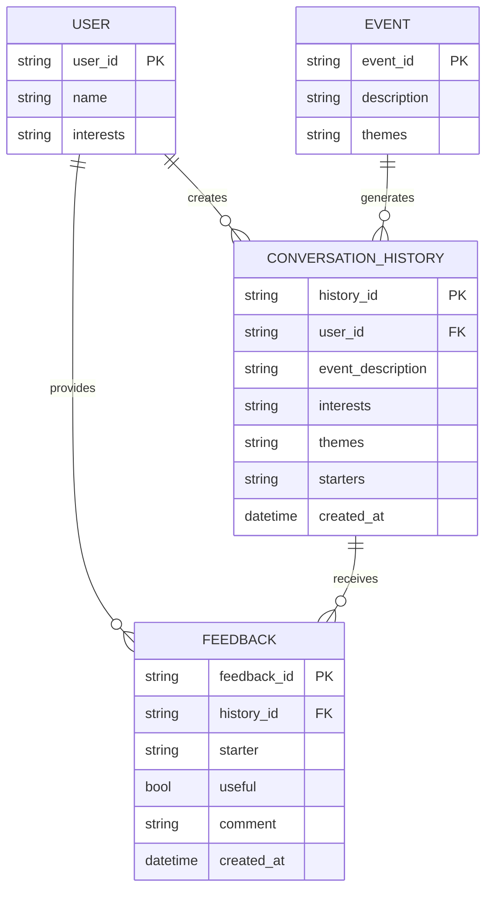

# Personalized Networking Assistant

An AI-powered web application that generates tailored conversation starters for networking events, verifies quick facts with Wikipedia, and stores conversation history plus user feedback.

## Features

- Extracts themes from event descriptions using a DistilBERT-ready analyzer service.
- Generates 2-3 context-aware conversation starters using a GPT-2-ready generator service.
- Fact-checks topics through the Wikipedia REST API.
- Stores conversation history and thumbs up/down feedback locally.
- Provides a FastAPI backend and Streamlit frontend.
- Includes pytest unit tests for services and routes.

## Project Structure

```text
app/
  main.py
  api/routes.py
  models/schemas.py
  services/
    event_analyzer.py
    topic_generator.py
    fact_checker.py
    history_logger.py
    feedback_logger.py
frontend/
  streamlit_app.py
tests/
  test_api_routes.py
  test_event_analyzer.py
  test_fact_checker.py
  test_topic_generator.py
data/
  history.json
  feedback.json
```

## ER Diagram



## Run Backend

```bash
uvicorn app.main:app --reload
```

Backend URL: `http://127.0.0.1:8000`

## Run Frontend

Open a second terminal:

```bash
streamlit run frontend/streamlit_app.py
```

## Run Tests

```bash
pytest
```

## Example API Request

```bash
curl -X POST http://127.0.0.1:8000/generate \
  -H "Content-Type: application/json" \
  -d "{\"event_description\":\"AI for Sustainable Cities\",\"interests\":[\"climate change\",\"urban planning\"],\"user_goal\":\"meet collaborators\"}"
```
